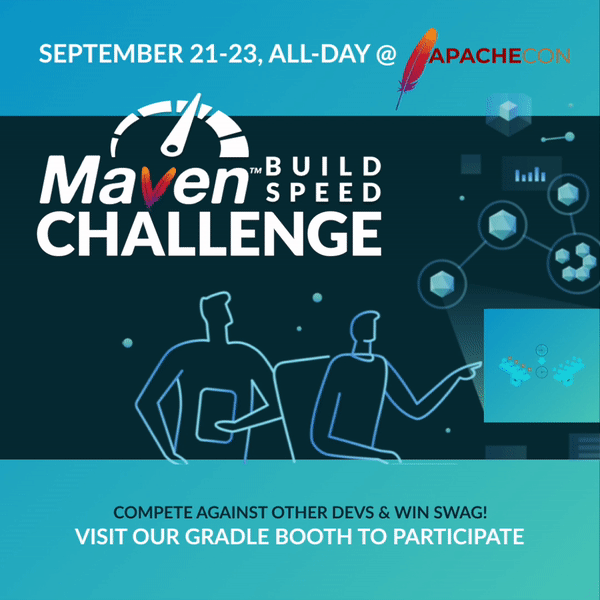

# ApacheCon 2021 Maven Build Speed Challenge
## How It Works

Roughly every two hours throughout the ApacheCon 2021 event, the Gradle Enterprise team will host a contest in the Gradle expo booth in HopIn.  Contestants will get a chance to speed up their Maven builds by trying out our Maven Build Cache (https://docs.gradle.com/enterprise/maven-build-cache/) and can verify their results using our free Maven Build Scan(tm)(https://scans.gradle.com/).

To participate, all you'll need to do is add the free Gradle Enterprise extension to the Maven project of your choice and connect to our contest server. You'll run a cached build, and post a screenshot of your cache savings from the free Build Scan(tm) interface.  The user with the highest cache avoidance savings % per-round will win a fantastic collection of Gradle swag -- that's right, prizes every round!

Feel free to participate as many times as you want, but, once you've won a single challenge you won't be eligible to win another.


### Step 1

Start with the Maven project of your choice.  If you'd rather not use a real project that you are working on, feel free to clone an open source one!  Note that project details such as dependencies, console logs, and failure messages will be captured during the scan. Here are some suggestions, but any Maven project will do:

- Maven Multi-Module Example (https://github.com/jitpack/maven-modular)
- Spring Boot Apache Camel Archetype:
```
mvn archetype:generate \
  -DarchetypeGroupId=org.apache.camel.archetypes \
  -DarchetypeArtifactId=camel-archetype-spring-boot
```
- Maven Build Scan Quickstart (https://github.com/gradle/maven-build-scan-quickstart)

Create a hidden directory (if it doesn't already exist) in the project root called .mvn.  You can use your IDE.  Alternatively, in Windows you can use the File Explorer, or for Linux/Mac/UNIX you can run:

>mkdir .mvn

### Step 2

Create a file called extensions.xml inside of the .mvn directory, if it doesn't already exist, and add the following code snippet:

```
<extensions>
    <extension>
        <groupId>com.gradle</groupId>
        <artifactId>gradle-enterprise-maven-extension</artifactId>
        <version>1.11</version>
    </extension>
</extensions>
```

If the file already exists, just add the 'extension' XML block to whatever is already there:

```
<extensions>

   ...

    <extension>
        <groupId>com.gradle</groupId>
        <artifactId>gradle-enterprise-maven-extension</artifactId>
        <version>1.11</version>
    </extension>

  ...

</extensions>
```
You may use the sample extensions.xml file included in this project if you'd like.

### Step 3

Create a configuration file for the plugin.  This file contains temporary credentials which will work for the duration of ApacheCon against our public Gradle Enterprise instance.  Note that this instance will not be available after the show, but you can always contact us to set up another one!

```
<gradleEnterprise>
    <server>
        <url>https://events.gradle.com/</url>
    </server>
    <buildCache>
        <remote>
            <storeEnabled>false</storeEnabled>
            <server>
                <credentials>
                    <username>apachecon2021</username>
                    <password>ap4c#e474c43!</password>
                </credentials>
            </server>
        </remote>
    </buildCache>
</gradleEnterprise>
```

You may use the sample gradle-enterprise.xml file included if you'd like.

### Step 4

Run the first build with:

>mvn clean verify

The first build will get a baseline score, and will publish a Build Scan(tm) for you to view.  Feel free to check it out!  For the contest, the most important screen will be Performance -> Goal execution -> Avoidance Savings:


The first time you run it, nothing will have been cached, so your avoidance will be 0% on the first pass.

### Step 5
  
Run the build again, using the same command:

>mvn clean verify

The second will run the same build again, but will pull reusable entries from the Maven Build Cache.  This time you should see significant avoidance savings!


### Step 6

Take a screenshot of your scan with the Avoidance savings percentage showing and post it to our **#sponsor-gradle** (https://apachecon.slack.com/archives/C02EVP12THA) channel in the ApacheCon Slack.  If you'd rather not post to the slack, you can also email the screenshot to us at: 
>training-team@gradle.com  

An hour after the contest begins, the participant with the highest Avoidance savings will win!  Winners will be contacted via the HopIn platform to arrange shipping of prizes.